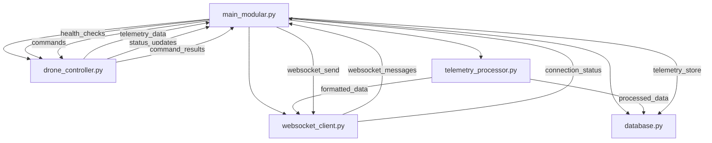

# ReliefWings Drone Telemetry System - Python Components

## Overview

The Python telemetry system has been refactored into a modular architecture for better maintainability, testability, and code organization. Each module handles a specific aspect of the drone telemetry system.

## Architecture

```
python/
├── main_modular.py          # Main orchestrator (NEW - modular version)
├── main.py                  # Original monolithic version (LEGACY)
├── websocket_client.py      # WebSocket communication module
├── database.py              # SQLite database operations
├── drone_controller.py      # DroneKit vehicle operations
├── telemetry_processor.py   # Data processing and validation
├── config.py                # Configuration management
├── requirements.txt         # Python dependencies
└── README.md               # This documentation
```

## Module Descriptions

### 1. `main_modular.py` - System Orchestrator
**Main entry point for the modular system**
- Coordinates all components
- Manages system lifecycle
- Handles callbacks between modules
- Provides health monitoring
- Graceful shutdown handling

**Key Features:**
- Async/await architecture
- Signal handling (SIGINT, SIGTERM)
- Component health checks
- Automatic telemetry buffering and resending

### 2. `websocket_client.py` - WebSocket Communication
**Handles all WebSocket communication with the backend server**
- Connection management with auto-reconnection
- Message serialization/deserialization
- Authentication support
- Callback system for events
- Ping/pong heartbeat monitoring

**Key Features:**
- Automatic reconnection with exponential backoff
- Message queuing during disconnections
- SSL/TLS support ready
- Event-driven architecture

### 3. `database.py` - Data Persistence
**SQLite database operations for offline telemetry buffering**
- Telemetry storage and retrieval
- Command logging and status tracking
- Event logging
- Data cleanup and maintenance
- Database health statistics

**Key Features:**
- Indexed tables for performance
- Automatic data cleanup
- Unsent telemetry tracking
- Command execution history

### 4. `drone_controller.py` - Vehicle Operations
**DroneKit integration for Pixhawk communication**
- Vehicle connection management
- Real-time telemetry collection
- Command execution (arm, disarm, takeoff, land, goto, etc.)
- Flight mode management
- Connection health monitoring

**Key Features:**
- DroneKit attribute listeners
- Comprehensive telemetry data structure
- Command result callbacks
- Connection recovery mechanisms

### 5. `telemetry_processor.py` - Data Processing
**Telemetry data validation, formatting, and enrichment**
- Data validation against rules
- Derived data calculation (distance, velocity, etc.)
- Format conversion (WebSocket, database)
- Processing statistics
- Health metrics

**Key Features:**
- Configurable validation rules
- Data enrichment (signal quality, battery health)
- Multiple output formats
- Processing history tracking

### 6. `config.py` - Configuration Management
**Centralized configuration with environment variable support**
- DroneConfig, WebSocketConfig, DatabaseConfig, TelemetryConfig
- Environment variable loading
- Default value management
- Configuration validation

**Key Features:**
- Type-safe configuration classes
- Environment variable override
- Easy configuration updates

## Installation

1. **Install Python dependencies:**
```bash
cd python/
pip install -r requirements.txt
```

2. **Set up environment variables (optional):**
```bash
export DRONE_ID="DRONE_001"
export VEHICLE_CONNECTION="/dev/ttyUSB0"
export WEBSOCKET_URL="ws://localhost:8080"
export LOG_LEVEL="INFO"
```

## Usage

### Running the Modular System
```bash
cd python/
python main_modular.py
```

### Running with Custom Configuration
```bash
DRONE_ID="RESCUE_DRONE_01" VEHICLE_CONNECTION="tcp:127.0.0.1:5760" python main_modular.py
```

### Development Mode (with detailed logging)
```bash
LOG_LEVEL="DEBUG" python main_modular.py
```

## Configuration Options

### Environment Variables

| Variable | Description | Default |
|----------|-------------|---------|
| `DRONE_ID` | Unique drone identifier | `DRONE_001` |
| `VEHICLE_CONNECTION` | Pixhawk connection string | `/dev/ttyUSB0` |
| `VEHICLE_BAUD_RATE` | Serial baud rate | `57600` |
| `WEBSOCKET_URL` | Backend WebSocket URL | `ws://localhost:8080` |
| `DATABASE_PATH` | SQLite database path | `/tmp/drone_telemetry.db` |
| `TELEMETRY_INTERVAL` | Telemetry collection rate (seconds) | `1.0` |
| `LOG_LEVEL` | Logging level (DEBUG, INFO, WARNING, ERROR) | `INFO` |
| `LOG_FILE` | Log file path | `/tmp/drone_telemetry.log` |

### Connection Strings Examples
- **Serial USB**: `/dev/ttyUSB0` (Linux) or `COM3` (Windows)
- **TCP**: `tcp:127.0.0.1:5760`
- **UDP**: `udp:127.0.0.1:14550`
- **Simulation**: `tcp:127.0.0.1:5760` (SITL)

## Component Communication



## Error Handling

- **Connection Failures**: Automatic reconnection with exponential backoff
- **Data Validation Errors**: Logged with detailed error information
- **Command Execution Failures**: Proper error responses sent to backend
- **Database Errors**: Graceful degradation with in-memory fallback
- **WebSocket Disconnections**: Automatic buffering and resending

## Monitoring and Health Checks

The system provides comprehensive health monitoring:

1. **Component Health**: Each module reports its health status
2. **Connection Monitoring**: Vehicle and WebSocket connection health
3. **Data Quality**: Telemetry validation and processing statistics
4. **Resource Usage**: Database size, memory usage, processing rates
5. **System Metrics**: Overall system health and performance

## Migration from Legacy

To migrate from the original `main.py`:

1. **Backup**: Keep the original `main.py` as reference
2. **Test**: Run `main_modular.py` in a test environment
3. **Configure**: Set environment variables as needed
4. **Deploy**: Replace the startup script to use `main_modular.py`

## Development and Testing

### Running Individual Modules
Each module can be imported and tested independently:

```python
from websocket_client import WebSocketClient
from database import TelemetryDatabase
from drone_controller import DroneController
from telemetry_processor import TelemetryProcessor

# Test individual components
```

### Adding New Features
1. **Create new module** following the established pattern
2. **Add callbacks** to communicate with main orchestrator
3. **Update configuration** in `config.py`
4. **Add dependencies** to `requirements.txt`
5. **Update documentation**

## Troubleshooting

### Common Issues

1. **Connection Failed**: Check device permissions and connection string
2. **WebSocket Errors**: Verify backend server is running and accessible
3. **Database Locked**: Ensure proper cleanup of database connections
4. **Import Errors**: Check Python dependencies are installed
5. **Permission Denied**: Ensure user has access to serial devices

### Debug Mode
```bash
LOG_LEVEL="DEBUG" python main_modular.py
```

### Logs Location
- **Application logs**: `/tmp/drone_telemetry.log`
- **Database**: `/tmp/drone_telemetry.db`
- **System logs**: Check systemctl logs if running as service

## Performance Considerations

- **Telemetry Rate**: Adjust `TELEMETRY_INTERVAL` based on requirements
- **Database Cleanup**: Regular cleanup prevents database bloat
- **Buffer Sizes**: Configure buffer sizes based on connection reliability
- **Resource Monitoring**: Monitor CPU and memory usage in production

## Security Considerations

- **Serial Access**: Secure physical access to drone hardware
- **Network Communication**: Consider TLS/SSL for WebSocket connections
- **Data Storage**: Encrypt sensitive telemetry data if required
- **Authentication**: Implement proper authentication for production use
